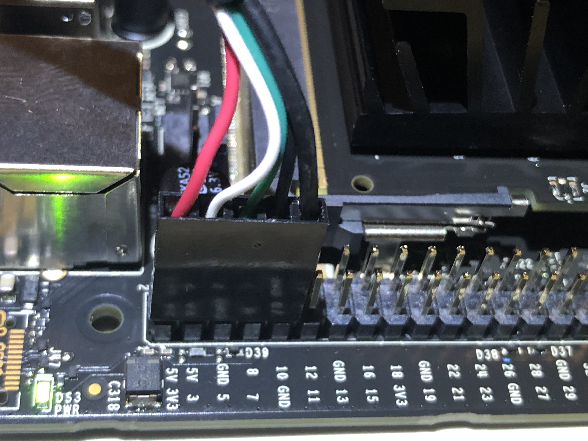

<h1>Enviornmental Sensor Setup</h1>

1. Connect in the 5 pin USB cable into the environmental sensor with the black wire connected to the ground pin
  </img>

2. With the Nano powered off, connect the other end of the cable into the nano on the bottom leftmost set of 5 pins on the 40-pin expansion header.
The black wire should connect to the ground pin and the red wire should connect to the pin labeled 3v3
  </img>

## Now the enviornmental sensor is all setup!

See `enviSensor/enviSensorDemo.ipynb` for more information on the sensor including how to interact with it using Python.
