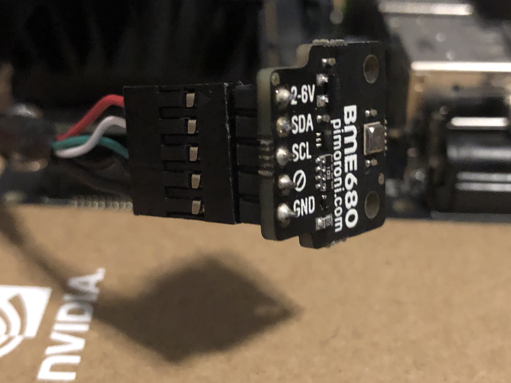

<h1>Enviornmental Sensor Setup</h1>

1. Connect in the 5 pin USB cable into the environmental sensor with the black wire connected to the ground pin
  </img>

2. With the Nano powered off, connect the other end of the cable into the nano on the bottom leftmost set of 5 pins on the 40-pin expansion header.
The black wire should connect to the ground pin and the red wire should connect to the pin labeled 3v3
  </img>

3. Turn on the Nano

4. Install the packages required for the environmental sensor by runing the following command:  
  `python3 -m pip install bme680`

5. Clone the BME680 GitHub repository by running the following command:  
  `git clone https://github.com/pimoroni/bme680`
    1. This will give us access to some sample code that we will use to 'burn in' the sensor
    
6. Navigate to the `/bme680-python/examples/` directory

7. Run the `read-all.py` script by runing the following command:  
  `python3 read-all.py`
    1. Leave this running for about 20 min the first time you set up the sensor
    2. Wait until the gas resistance value stabilizes. This is the last value shown in each line in units of Ohms.
    3. You can press `control` + `c` to stop the example
    
<h3>The enviornmental sensor is all set up now and ready for you to use!</h3>

See `enviSensor/enviSensorDemo.ipynb` for more information on the sensor including how to interact with it using Python.
