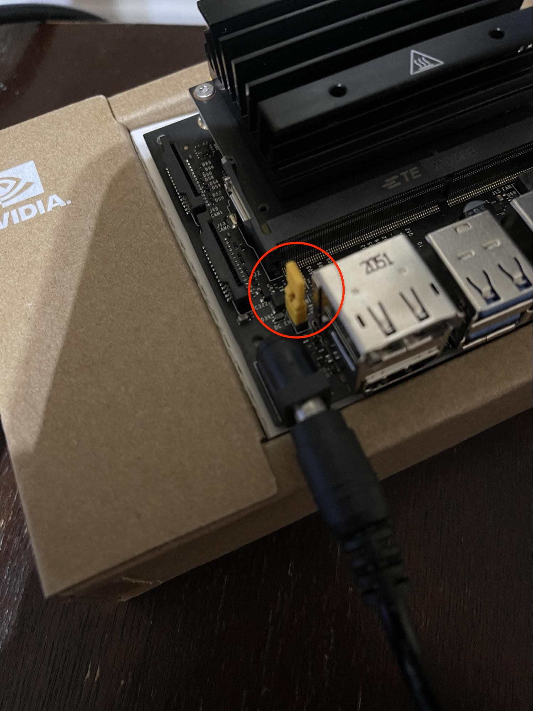

 1. Follow this link to Nvida's website: [Getting Started with Jetson Nano](https://developer.nvidia.com/embedded/learn/get-started-jetson-nano-devkit#intro)
 2. Read the introduction and familiarize yourself where the different components are located on the nano
 3. Write the image to your microSD card by following the instructions under "Write Image to the microSD Card"
 4. Proceed with the rest of the instructions for whichever type of device you are using
	 1. If you're unable to go directly insert the microSD into your computer, use the microSD to USB/USB-C adapter
 5. After a successful flash, unbox your developer kit box and follow the paper instructions in making the nano's stand
 6. Insert the microSD card into the underside of the nano as shown below </img>
 7. Locate the two pins on the bottom side of the nano that have "ADD JUMPER TO DISABLE uUSB PWR" and match them to the pins on the upside of the nano
 8. Add a jumper to those pins, so it allows power through the DC cable </img>
 9. Connect the USB Wi-Fi adapter </img>
 10. Once the jumper is in the correct position, plug in the 1 = DC cable, 2 = monitor, 3 = mouse and keyboard </img>
 11. Follow the [Initial Setup with Display Attached](https://developer.nvidia.com/embedded/learn/get-started-jetson-nano-devkit#setup-display) instructions under the [Setup and First Boot](https://developer.nvidia.com/embedded/learn/get-started-jetson-nano-devkit#setup) module from Nvida's website
	 1. Review and accept NVIDIA Jetson software EULA
	 2. Select system language and keyboard layout
	 3. Connect to the desired Wi-Fi connection and select your time zone
	 4. Create username, password, and computer name
	 5. Select APP partition size, leave this to the default value
	 6. Select Nvpmodel Mode, keep the default setting here as well
12. At initial login screen, restart the system to allow additional installation (select "Shut Down..." from the gearbox on the upper right of the screen)
13. Update the software
	1. Open the search menu (top left of the screen), type "Software Updater," and select it
	2. If you're connected to the internet, it will show a new set of updates
	3. Download and install the updates
	4. Restart the system
14. You now have a working Linux environment!

**Next, read the [Python setup instructions](https://github.com/ddiLab/SageEdu/blob/main/setup/general/pythonSetup.md) to be able to use python on your Nano.**
