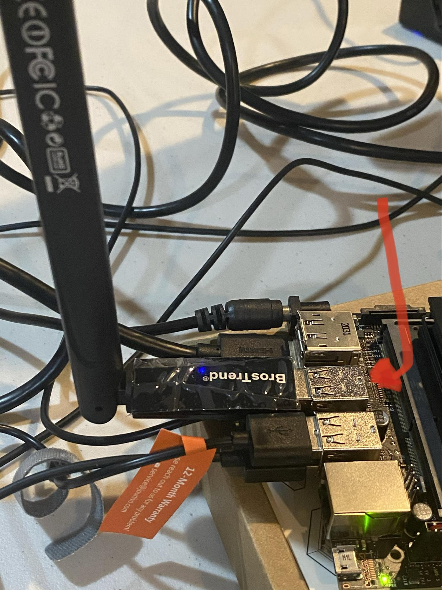

 1. Follow this link: [Getting Started with Jetson Nano](https://developer.nvidia.com/embedded/learn/get-started-jetson-nano-devkit#intro)
 2. Read the introduction and familiarize yourself where the different components are located on the nano
 3. Write the image to your microSD card by following the instructions under "Write Image to the microSD Card"
 4. Insert your microSD card into your computer
	 i. If it is unable to go directly into your computer, use the microSD to USB/USB-C adapter 
 5.  Proceed with the rest of the instructions for whichever type of device you are using
 6. After a successful flash, unbox your developer kit box and follow the paper instructions in making the nano's stand
 7. Insert the microSD card into the underside of the nano as shown below </img>
 8. Locate the two pins on the bottom side of the nano that have "ADD JUMPER TO DISABLE uUSB PWR" and match them to the pins on the upside of 
 9. Add a jumper to those pins, so it allows power through the DC cable </img>
 10. Once the jumper is in the correct position, plug in the 1 = DC cable, 2 = monitor, 3 = mouse and keyboard </img>
 11. Follow the "First Boot" and "After logging in" instructions under the "Setup and First Boot" module in the link from step 1
	 i. Review and accept NVIDIA Jetson software EULA
	 ii. Select system language, keyboard layout, and time zone
	 iii. Create username, password, and computer name
	 iv. Select recommended APP partition size
12. At initial login screen, restart the system to allow additional installation 
13. Connect the USB Wi-Fi adapter </img>
14. Connect to the desired Wi-Fi connection
15. Update the software
	i. Open the search menu (top left) and type "Software Updater"
	ii. If you're connected to the internet, it will show a new set of updates
	iii. Download and install the updates
	iv. Restart the system
16. You now have a working Linux environment!
