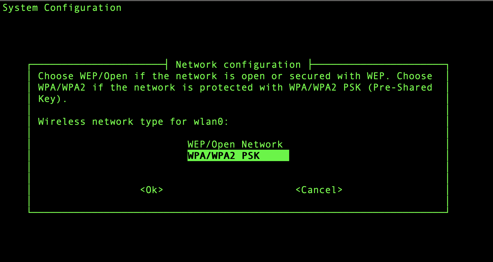

<h1> Setting up the Jetson Nano in Headless Mode</h1>

You can also look at <a href="https://developer.nvidia.com/embedded/learn/get-started-jetson-nano-devkit#setup-headless">
Nvida's guide on the initial setup in headless mode</a>

1) Follow the instructions on the <a href="https://developer.nvidia.com/embedded/learn/get-started-jetson-nano-devkit#write">
Getting Started with Jetson Nano Developer Kit</a> website to write the image to the microSD card
  
    1) Make sure to follow the correct set of instructions corresponding to your operating system
  
2) Insert the microSD card into the Nano
    1) The microSD card slot is located on the underside of the Nano
  <INSERT IMAGE HERE>
  
3) Jumper the J48 Power Selector Header Pins  
    1. Pins not jumpered:  
  </img>
  
    2. Pins Jumpered:
  </img>
  
4)  Connect the USB WiFi dongle to one of the Nano's USB ports

5) Connect your computer to the Nano via it's micro USB port
  
6) Follow the instructions on <a href="https://developer.nvidia.com/embedded/learn/get-started-jetson-nano-devkit#setup-headless">Nvidia's website</a> 
to set up the Nano according to your operating system
    
    </img>

7) Go through the setup process of license agreements, language, time zone, etc
    1) Leave the partition size to the default value

8) When you get to the Network Configuration Screen, select the `wlan0` option
  
  </img>

9) On the next screen select the `WEP/Open Network` option

  </img>

10) Leave the field blank and hit henter

11) It will say that it failed, just select the option to set it up later

12) Enter a name for the device
    1) This will be what we will reffer to as the Nano's name
    
13) Leave the next option to the default value

<h3>You should now be in the nano's command line!</h3>
Now let's setup the network.

14) Make note of the SSID of the network you want to connect to by running the following command:  
  `nmcli dev wifi list`
  
15) Connect to the wifi network by running the following command:  
  `sudo nmcli dev wifi connect [NETWORK SSID] password [NETWORK PASSWORD]`
    1) Where `[NETWORK SSID]` is replaced by the network's SSID noted in the last step
    and `[NETWORK PASSWORD]` is replaced by the network's password
    
16) Ping google.com to make sure its connected by running the following command:  
  `ping google.com`
      1) Use `control` +  `c` to stop the pinging

17) Update the nano by running the following commands:  
  `sudo apt update`  
  `sudo apt upgrade`
  
18) Shutdown the Nano by running the following command:  
  `sudo shutdown now`
    1) We do this so that all the updates we just performed will take effect
    2) Wait for the Nano's green light to turn off
    
19) Unplug the power supply from the Nano

20) Unplug the microUSB cord from the Nano

21) Plug the power supply back into the Nano

22) In a terminal on your computer connect to the Nano via ssh by running the following command:  
  `ssh [USERNAME]@[NANO NAME].local`
    1) Where `[USERNAME]` is replaced by your username on the Nano, and `[NANO NAME]` is replaced by the name you gave the Nano in step 12
    2) This is how you will be connecting to the Nano from now on!
  
And that's it, your Nano is all set up!

**Next, follow the instructions in the [general](https://github.com/ddiLab/SageEdu/tree/main/setup/general) directory to further customize the nano.**
